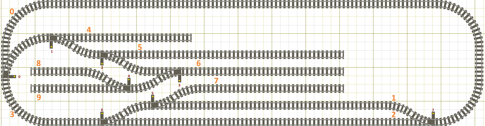
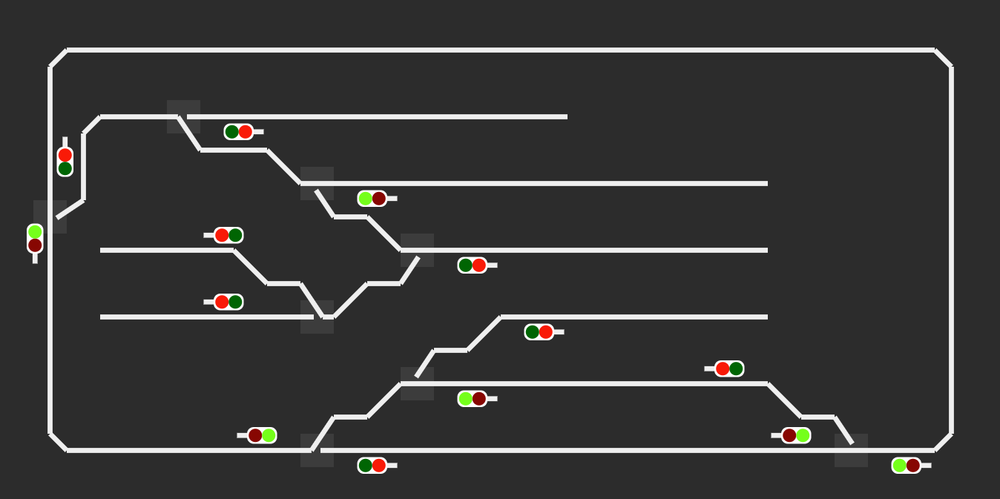

# BLE Train Control System

## Description
Software for controlling a physical train layout, with automated track switches, trains and signal lights by using [Bluetooth LE](https://en.wikipedia.org/wiki/Bluetooth_Low_Energy). 
The control is made within a WebApp  (Train Control Panel), on a tablet/computer device with BLE support, that features:
- Layout display showing:
  - Trains position on each layout segment
  - Signal Lights and its colours
  - Track switches positions
- Buttons for changing switches
- Train controls: Speed, direction, stop

The system is able to automatically drive signal lights and stop trains on red lights. Everything else is manually driven.

The system is highly configurable and the software is basically the same for every micro-controller's role, just with different static configurations. Each micro-controller can have the layout full state synchronized.

The system inter-communication is accomplished by Bluetooth advertising packets. The WebApp communicates using Bluetooth connection to one or more train drivers. These route the webapp commands to be advertised to the all network. This is because the current web Bluetooth implementations do not support advertising.
The Bluetooth connection from the WebApp to the train drivers allow for low latency commands of the trains, which would not be possible with advertising.

Several Train Control Panel can participate in the system controlling different trains.

## Documentation
- [Components](./docs/components.md)
- [State Machine](./docs/state-machine.md)
- [Layout Descriptors](./docs/layout-descriptor.md)

## BLE Train Control Panel

Included is the control panel webapp.

To run it:
- Clone this repo and go to `src/ble-train-control-panel`
- `$ npm i`
- `$ npm run serve` 

## Requirements: Hardware

Micro-controller with Bluetooth LE: Nordic Semiconductor nRF52832
  - Variants, Flash (kB), RAM (kB):
    - AA: 512 64
    - AB: 256 32

Power driver: DRV8833
  - 2x H-Bridge to drive motors and/or LEDs from the micro-controller outputs
  
## Requirements: Software
  
Micro-controller: [Espruino](https://www.espruino.com)

WebApp:
- Android 6.0, Chrome Mobile
- iOS, WebBLE mobile browser
- Windows 10 (1809 update), Chrome v70
