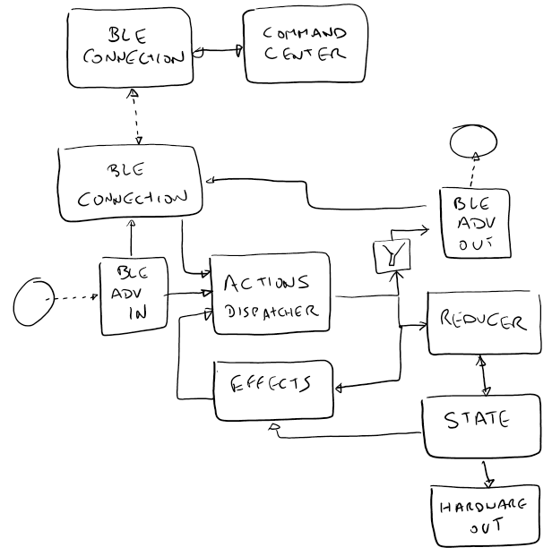

# State Machine
All logic is implemented via a custom state machine similar to [Redux](https://redux.js.org/)



State machine diagram (a bit outdated)

## State:
- Segments
- Trains
- Switches
- CurrentDeviceInfo
- layoutId
  
  
## Action common payload
- layoutId
- timestamp
- broadcasted (not present on BLE packets)
  
  
## Actions and Reducers
- TrainAdd(name, segmentId, isUncontrolled)
  - Updates Trains
- TrainPosition(trainId, segmentId, enteringSegmentId)
  - Updates Trains
- TrainSpeed(trainId, speed)
  - Updates Trains
- Switch(switchId, position, enabled)
  - Updates Layout
- SignalLight(segmentId, signalId, state)
  - Updates Segments
- MilestoneHit(trainId, segmentId, signalId, signalLightState)
- TrainSensor(state, segmentId, signalId)


## Reducers

- Reducer: Switch Availability
  - Devices: Train Control Panel
```text
On Action: TrainPosition(trainId, segmentId, enteringSegmentId)
    segmentPaths.forEach(path)
        If findTrainFromToSegments(segmentId, enteringSegmentId)
          switchInPath.forEach(switch)
            switch.enabled = !train; // Set to false must win if settings several times the same switch
```
  
  
 ## Action Sources

- Actions Source: Milestone Sensor
  - Devices: Train Driver
  - Input: BLE Advertising sensing for Milestone (provides: segmentId, signalId, signalLightState)
  - \>MilestoneHit
  - \>TrainSpeed(0) if sensor segmentId equals current train segmentId and sensor is red

- Actions Source: Milestone Sensor Simulator
  - Devices: Train Control Panel (simulator)
  - Input: train movement simulation
  - Same logic as "Actions Source: Milestone Sensor"

- Actions Source: Train Sensor
  - Devices: Train Sensor
  - Input: hardware sensor (provides: state)
  - \>TrainSensor

- Actions Source: Train Sensor Simulator
  - Devices: Train Control Panel (simulator)
  - Input: train movement simulation
  - Same logic as "Actions Source: Train Sensor"

- Actions Source: Train Add
  - Devices: Train Control Panel
  - \>TrainAdd

- Actions Source: Train Position Reset
  - Devices: Train Control Panel
  - \>TrainPosition
  - \>TrainSpeed

- Actions Source: Switch Change
  - Devices: Train Control Panel
  - \>Switch

- Actions Source: BLE Advertisement
  - Devices: All, except Train Control Panel
  - Input: BLE hardware
  - Dispatch BLE received action
  - Ignores repeated received actions by using timestamp

- Actions Source: BLE Connection
  - Devices: Train Driver
  - Input: BLE hardware
  - Dispatch BLE received action, setting broadcasted to false


## Effects

- Effect: BLE Advertisement
  - Devices: All, except: Train Control Panel, Track Milestone
  - Send all state Actions through BLE Advertising, if not broadcasted
  - BLE advertisement repeats last action at intervals

- Effect: BLE Connection
  - Devices: Train Driver
  - Send all state Actions through BLE Connection, if not broadcasted

- Effect: Train Actuator
  - Devices: Train Driver
  - On TrainSpeed
    - Updates hardware

- Effect: Switch Actuator
  - Devices: Switch
  - On Switch
    - Updates hardware

- Effect: Signal Light Actuator
  - Devices: Signal Light
  - On SignalLight
    - Updates hardware

- Effect: Milestone Update
  - Devices: Track Milestone
  - On SignalLight
    - Sets milestone device BLE Advertising with segmentId, signal light (id and state)

- Effect: Signal Lights Calculation
  - Devices: Signal Light, Train Control Panel (simulator)
```text
On Action: TrainPosition() or Switch()
  Layout.segments.ForEach(segment)
    forEach signalLight and paths in segment
      openPath = findOpenPath(paths)
      If openPath && !isSegmentOccupied(openPath.segment)
        >SignalLight(segment, signalLight, green), if it is not already and if owned by current device
      Else
        >SignalLight(segment, signalLight, red), if it is not already and if owned by current device
```

- Effect: Train Position Calculation for Milestone
  - Devices: Train Actuator, Train Control Panel (simulator)
```text
On Action: MilestoneHit(trainId, segmentId, signalId)
  If isInCurrentDevice(trainId) 
      If isTrainInsideSegment(trainId, segmentId)
          If isGreen(signalId)
              >TrainPosition(trainId, train.segmentId, enteringSegmentId = nextSegment(segmentId, signalId))
          Else
              >TrainSpeed(trainId, 0) // this can be done by "Actions Source: Milestone Sensor"
      ElseIf isTrainEnterSegment(trainId, segmentId)
          >TrainPosition(trainId, segmentId, enteringSegmentId = null)
```

- Effect: Train Position Calculation for Sensor
  - Devices: Train Control Panel for external trains
  - Devices: Train Actuator, Train Control Panel (simulator)
```text
On Action: TrainSensor(state, segmentId, signalId)
  If state == ON
      train = findTrainInsideSegment(segmentId)
      if train && isInCurrentDevice(trainId) 
          If isGreen(signalId)
              >TrainPosition(train.Id, train.segmentId, enteringSegmentId = nextSegment(segmentId, signalId)))
          Else
              >TrainSpeed(trainId, 0)
      Else
          train = findTrainEnterSegment(segmentId)
          if train && isInCurrentDevice(trainId) 
              >TrainPosition(trainId, segmentId, enteringSegmentId = null)
```

- Effect: Train Green-Go
  - Devices: Train Control Panel for external trains
  - Devices: Train Actuator, Train Control Panel (simulator)
```text
On Action: SignalLight(segmentId, signalId, state)
  If state == GREEN
      train =  findTrainInsideSegment(segmentId)
      if train && train.speed == 0 && train.speedBeforeStop !== 0 &&  isInCurrentDevice(trainId) 
          >TrainPosition(trainId, train.segmentId, enteringSegmentId = nextSegment(segmentId, signalId))
          >TrainSpeed(train.speedBeforeStop)
```
